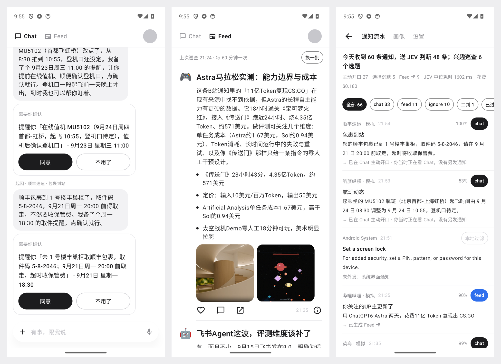

# Spell Mini

通知驱动的主动助理 demo（Android）：后台读取手机上的每条通知，用一个轻量的结构化决策模型判断去向，要紧的事由主对话模型在 Chat 里
以助理口吻主动开口，感兴趣的内容联网延展后做成 Feed 卡片。单个 APK，没有后端。

> **隐私提示**：这是一个实验性 demo。开启通知使用权后，手机上**所有 App 的通知正文都会发送给外部模型**（经 OpenRouter 到
> JEV；判到 chat 或 feed 的再到 DeepSeek），包括工作消息和别人发给你的私聊。只建议装在自己的测试机上；设置里可以逐个 App 关闭，
> 也可以关掉总开关（关闭后通知只记入本地流水）。

产品形态是两个页面：Chat（和助理对话、助理主动发消息）与 Feed（助理替你整理的阅读卡片）；主动触发采用两层判断：
先判相关性决定进 Chat 还是 Feed，再由主模型决定执行、建议还是沉默。



## 链路

```
通知 → 本地过滤 → 合并同一会话的连续更新 → JEV（route 四选一 + urgency 评分，一次请求）
  chat   → 主对话模型，可调用工具；可以选择沉默 → Chat 里主动发一条（App 不在前台时发系统通知）
  feed   → 选题 → 联网搜索 → 写卡 → 抓封面图 → Feed 卡片；任何一步认为不值得做都会放弃
  ignore → 只进通知流水
  review / JEV 失败 → 主对话模型二判，不直接丢
```

每条通知在「通知流水」里留一行：判定、各选项概率、置信度、紧急度、耗时、费用、下游结果（含沉默原因）。
点右上角的球进入，可导出 JSONL。

## 产品决定

| 分支 | 决定 |
|---|---|
| 数据边界 | 默认把全部通知送去判断，不做屏蔽；保留逐 App 开关和总开关 |
| 执行 | 联网搜索 + 本机轻动作（建日程、闹钟、提醒、打开 App、打开原通知、拨号）；写操作只生成确认卡，点「同意」才执行 |
| 画像 | 「我写的」模型不可改；「模型记的」可自动更新、单条可删、有更新记录 |
| Feed | 图文卡；配图取引用网页的 og:image，取不到或太小就不放 |
| 开口门槛 | 分级：JEV 紧急度 ≥ 门槛（默认 2.0）的必须开口并弹出提醒；低于门槛的有增量才开口、只响铃不弹出。沉默原因和通知方式都记入流水。设置里可关掉分级，回到「一律有增量才开口」 |

## Feed 的两个来源

1. **通知触发**：JEV 判 `feed` → 选题 → 联网搜索 → 写卡。搜索撑不起一张完整的卡时不再丢弃，而是出一张「轻量卡」：
   标题、为什么你可能感兴趣，以及「打开原内容」直接跳回来源 App。所有通知触发的卡都有这个跳转。
2. **兴趣巡查**：不靠通知，每 60 分钟主动提最多 3 个选题，走同一条搜索—写卡链路；0 点到 7 点不跑，打开 Feed 到点了也会跑，
   可手动「再来一批」。每个选题在通知流水里记一行（来源「兴趣巡查」），包括被拦下的和原因。
   - **选题依据有先后**：第一依据是你最近在关注的事（最近 24 小时在聊天里说的话、和你有关的通知、刚点过喜欢的卡），
     第二依据才是画像里的长期兴趣。画像几小时才更新一次，只靠它 Feed 会一直绕着同几个兴趣打转。
   - **不重复，由代码保证**：同一兴趣出过卡后冷却 8 小时；新选题和最近 24 小时做过的选题比对（字符二元组重合度 ≥ 0.30 判为同一件事）；
     搜索之后，引用的来源有一半以上已被别的卡用过，判为同一份内容。只给模型看「最近的卡片标题」是拦不住的——
     它会换个说法把同一件事再写一遍。

## 主动消息的口吻与核对

- 每条主动消息按「谁、什么事 → 我替你做了什么或我的建议 → 下一步」来说，用「你/我」，第三方叫名字。
- 开口的三种理由：能备好动作、查到了有用的信息、这件事值得你关注（被 @、手头项目、钱与安全、行程）。
  闲聊、刷屏、看过即可的回执、别人的情绪私事保持沉默。
- 「备好了」「已经设过了」这类话必须有依据：要么这一轮真的出了确认卡，要么工具返回了 `already_done`。
  是否重复由代码比对（只对闹钟、提醒、日程这类留下持久状态的动作），不靠模型印象；没有依据的那句话会被删掉并记入流水。
- 聊天历史回灌给模型时，卡片和系统记录不算作助理说过的话。早期版本把它们渲染成「[确认卡｜…]」，模型学会了
  用文字假装出卡，卡片因此点不了。

## 测试

`DebugReceiver`（仅 debug 包，受 `android.permission.DUMP` 保护，只有 adb 能调用）可以注入中文消息和通知：

```bash
adb shell "am broadcast -a com.logan.spellmini.DEBUG_SEND   -p com.logan.spellmini --es text '你打 10086'"
adb shell "am broadcast -a com.logan.spellmini.DEBUG_NOTIFY -p com.logan.spellmini --es app 微信 --es title 老周 --es text '周六吃饭吗'"
```

`tools/e2e_cards.py` 在模拟器上跑八条确认卡路径：注入请求 → 要求数据库里有真卡 → 点屏幕上的按钮 → 到系统里核实副作用。

## 模型

| 用途 | 接口 | 模型 |
|---|---|---|
| 分流 | `POST https://openrouter.ai/api/alpha/decisions` | `typesafe/jev-1.13` |
| Chat、Feed、画像、二判 | `POST https://openrouter.ai/api/v1/chat/completions` | `deepseek/deepseek-v4.1-flash` |
| 联网搜索 | 同上，加 `plugins: [{"id": "web"}]`（Exa，中文结果好） | 同上 |

推理分三档：你主动聊天用低强度（约 1.7 秒，关掉只快 0.1 秒但动作不可靠）；通知触发和画像更新全开；选题、写卡、搜索关闭。
所有对话调用加了 `provider.sort=throughput`：默认按价格分流时同一个请求在不同供应商上是 13 秒和 93 秒，按吞吐量后稳定在 4.5–7.4 秒，贵约 20%。JEV 判据用英文，设置页可改，
每条流水记录判据版本号。

## 构建与安装

```bash
export JAVA_HOME=/opt/homebrew/opt/openjdk@17/libexec/openjdk.jdk/Contents/Home ANDROID_HOME=$HOME/Library/Android/sdk
./gradlew :app:assembleDebug
adb install -r app/build/outputs/apk/debug/app-debug.apk
```

`local.properties`（已被 git 忽略）需要 `OPENROUTER_API_KEY=...`。key 只打进 debug 包，**这个 APK 不要外传**。

首次启动后在手机上手动完成两件事（App 的「设置」页有跳转按钮）：开启通知使用权；允许不受电池优化限制。

## 已知问题与风险

- 通知正文是不可信输入。缓解手段：提示词把它标为数据、写操作必须过确认卡、确认卡文案由实际参数生成而不是模型的话。
  这只能降低风险，不能消除。
- 模型会算错时间差、星期和相对日期（把后天说成明天）。系统提示里给了未来七天的日期对照表，并要求写具体日期而不是
  「明天」「今晚」；确认卡上的时间由代码格式化。
- 0.1 版把几乎所有主动消息发到了静音渠道（阈值 2.5，而实测要紧的事只有 1.5–2.4 分），看起来像「判了 chat 却没推」。
  0.2 版换了通知渠道（渠道的重要性创建后不能改，所以用了新的渠道 id）并把阈值降到 2.0。
- 画像自动更新可能把一次性的事写成习惯，已在提示词里禁止，但仍需人工抽查「模型记的」。
- Android 15+ 会对第三方监听器隐藏验证码类通知的正文，真机上需实测。
- Room 使用破坏性迁移：改表结构会清空本地数据。
- 「重判」会重新触发下游，可能产生重复的主动消息，仅用于调试。
