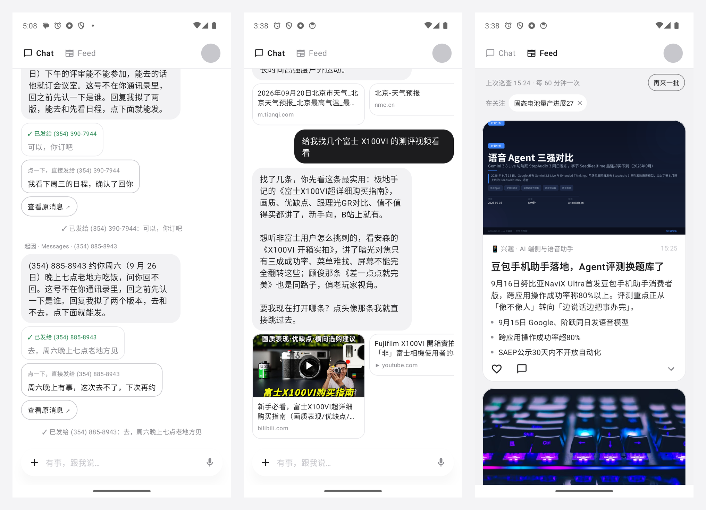
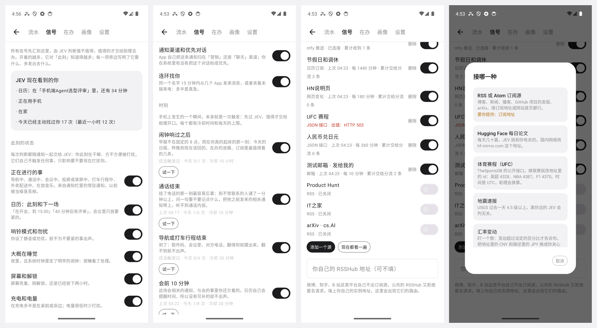
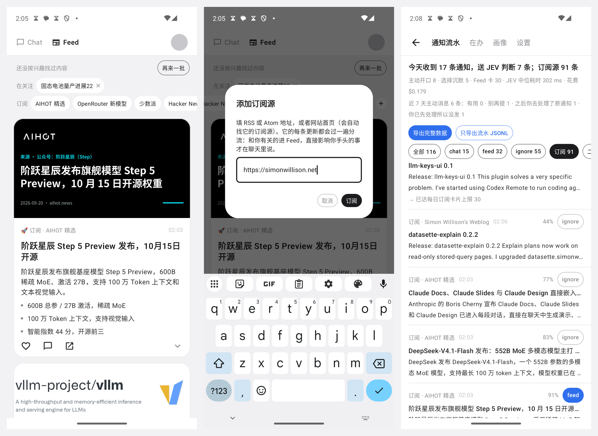
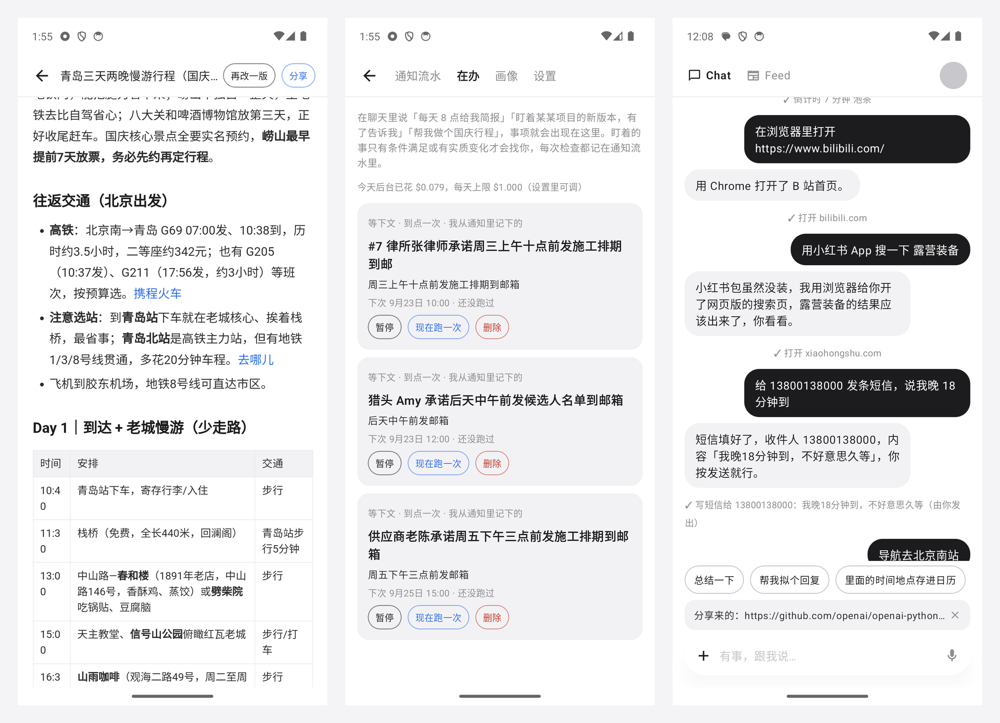
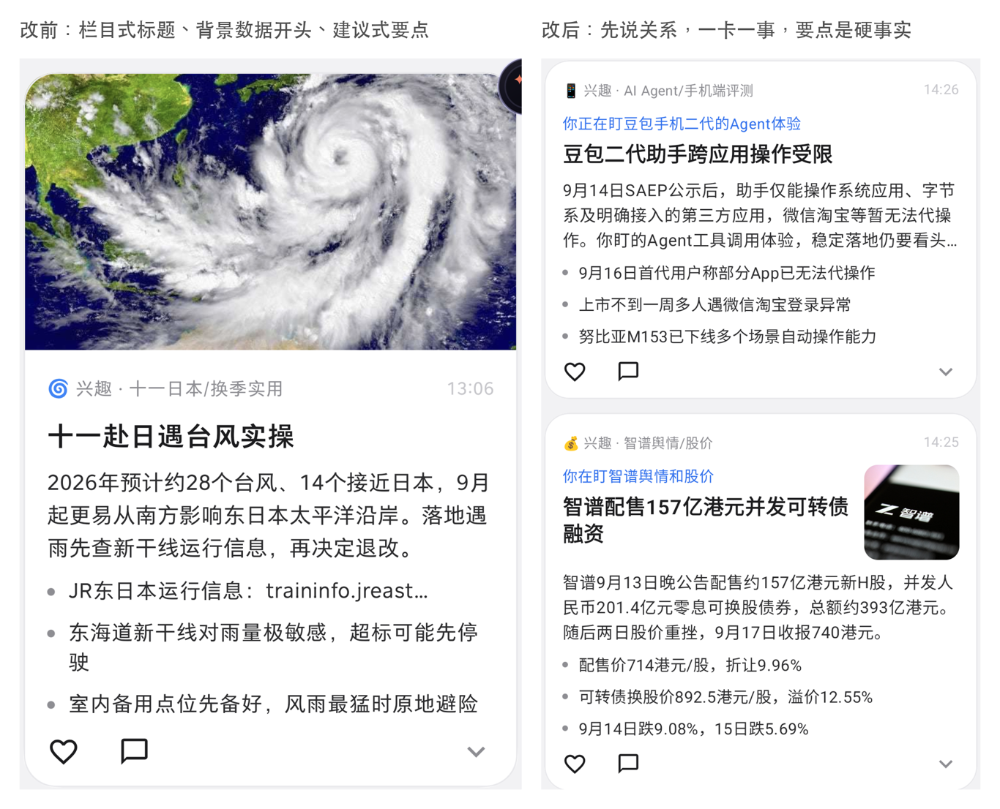

# Spell Mini

通知驱动的主动助理 demo（Android）：后台读取手机上的每条通知，用一个轻量的结构化决策模型判断去向，要紧的事由主对话模型在 Chat 里
以助理口吻主动开口，感兴趣的内容联网延展后做成 Feed 卡片。单个 APK，没有后端。

> **隐私提示**：这是一个实验性 demo。开启通知使用权后，手机上**所有 App 的通知正文都会发送给外部模型**（经 OpenRouter 到
> JEV；判到 chat 或 feed 的再到 DeepSeek），包括工作消息和别人发给你的私聊。只建议装在自己的测试机上；设置里可以逐个 App 关闭，
> 也可以关掉总开关（关闭后通知只记入本地流水）。

产品形态是两个页面：Chat（和助理对话、助理主动发消息）与 Feed（助理替你整理的阅读卡片）；主动触发采用两层判断：
先判相关性决定进 Chat 还是 Feed，再由主模型决定执行、建议还是沉默。



## 链路

```
通知 → 本地过滤（含「旧会话被 App 重新贴出」「最新一条是你自己发的」）→ 合并同一会话的连续更新 → JEV（route 四选一 + urgency 评分，一次请求）
  chat   → 主对话模型，可调用工具；可以选择沉默 → Chat 里主动发一条（App 不在前台时发系统通知）
  feed   → 选题 → 联网搜索 → 写卡 → 抓封面图 → Feed 卡片；任何一步认为不值得做都会放弃
  ignore → 只进通知流水
  review / JEV 失败 / 险胜的 ignore（chat 概率 ≥ 0.40）→ 主对话模型二判，不直接丢

订阅源的新条目 → 同一条流水线，JEV 多答两道题（是不是同一条新闻、和你的贴合度）→ 成卡 / 少数情况在 Chat 里说 / 只进流水（见「订阅源」一节）
手机上的一个时刻（挂了电话、闹钟响过、到家、会前十分钟、截了图……）→ 同一条流水线，JEV 按「此刻帮不帮得上」判 → 值得才交给主模型，多数以沉默结束（见「信号」一节）
每一次判断都带着 right_now（他此刻在干嘛）和 sender（这个人对他多重要），并多答一道「现在打扰，还是静默送达」
```

每条通知在「通知流水」里留一行：判定、各选项概率、置信度、紧急度、耗时、费用、下游结果（含沉默原因）。
点右上角的球进入，可导出 JSONL。

## 产品决定

| 分支 | 决定 |
|---|---|
| 数据边界 | 默认把全部通知送去判断，不做屏蔽；保留逐 App 开关和总开关 |
| 执行 | 联网搜索 + 手机动作，**不出确认卡**：你开口要的直接做；到点提醒和定时任务直接生效、可一键撤销；后台（通知触发）里需要打开界面的动作变成消息下面的按钮，点了才执行。详见「动作」一节 |
| 画像 | 「我写的」模型不可改；「模型记的」可自动更新、单条可删、有更新记录 |
| Feed | 图文卡；配图取引用网页的 og:image，取不到或太小就不放 |
| 开口门槛 | 分级：JEV 紧急度 ≥ 门槛（默认 2.0）的必须开口并弹出提醒；低于门槛的有增量才开口、只响铃不弹出。沉默原因和通知方式都记入流水。设置里可关掉分级，回到「一律有增量才开口」 |

## 动作

0.5 及以前，所有会改动手机的动作都先出一张确认卡。真机跑了一天，36 张卡里 26 张是「提醒你回一下某某」，没人点，Chat 变成了待办列表。
0.6 改成对话流：

| 场景 | 行为 |
|---|---|
| 你在聊天里开口要的 | 直接执行，聊天里留一行「✓ 做了什么」。这些动作的最后一步（按下拨出、点保存、点发送）本来就在你手里，所以不需要再确认一次 |
| 到点提醒 `set_reminder`、定时任务 `schedule_task` | 直接生效，记录旁边有「撤销」。定时任务到点后由助理自己去查、去整理，再把结果发给你——「到时候我整理一份发你」从此是真的 |
| 通知触发的后台轮次 | Android 不允许后台 App 打开界面，也没有人开口要，所以动作变成消息下面的按钮（最多两个），点了才执行；每条主动消息自带「查看原消息」 |
| 同一轮里第二个要开界面的动作 | 第一个已经把我们切到后台，第二个同样变成按钮 |

能做的动作（都是标准 Android intent，不需要额外权限）：建日程、闹钟、倒计时、打开 App、打开链接或 App deeplink、拨号、写短信/邮件（填好由你发送）、
地图查看与导航、22 个系统设置页、分享面板、复制到剪贴板、新建联系人、音乐搜索播放、相机；以及 Feed 控制：关注/取消关注主题、立刻刷新一批。

- **拟好回复，一键发出**：别人发来的消息需要回一句时，助理替你拟好（要你拿主意的事给两个版本，或给一个不做承诺的稳妥版本），
  做成消息下面的按钮，按钮上是回复全文。微信和飞书都没有「打开某个聊天并预填文字」的 deeplink（飞书 AppLink 的
  `client/chat/open` 只接受 `openId`/`openChatId`，没有文字参数，而且通知里拿不到这两个 ID；微信不对第三方开放会话级跳转），
  所以走通知自己的通道：
  - 通知带「快捷回复」动作（一个带自由文本 `RemoteInput` 的 action）时，点一下按钮，这句话就在那个会话里发出去，不用切 App；
  - 不带的，点一下会把这句话放进剪贴板，并用这条通知自己的跳转打开那个聊天，粘贴后发送。
  走哪条路在点击的那一刻判断（快捷回复只在通知还在、进程没重启时有效），按钮上写的是实际发生的事：「已发给某某」或「已复制」。
  这是唯一一个会以你的名义对别人说话的动作，所以它永远只是按钮，不会自动执行；发过的按钮不能再点第二次。
  聊天里也可以说「回老周说可以」「把刚才那句改客气点」，助理会按名字找到最近一天里那条通知，重新出按钮。
- **deeplink**：`open_link` 接受 https 和自定义 scheme。模型凭记忆写 deeplink（`bilibili://search?keyword=…`），代码先用 `resolveActivity`
  检查手机上有没有 App 能接；没有就把错误还给模型，它会退回 https 页面或如实说没装。`javascript:`、`file:`、`content:`、`intent:` 等 scheme 直接拒绝。
  页面对不对无法验证，工具结果只说「已交给某某 App 打开」。
- **地图**：只有地名、没有坐标，所以只用接受关键词的 URI。高德的导航和路线规划 URI 要求经纬度，只能用它的关键词搜索
  `androidamap://poi`；百度的 `baidumap://map/navi?query=` 可以直接按地名导航；其余走平台标准的 `geo:`。格式取自两家的 URI API 文档，
  模拟器上只验证了 Google Maps。
- **后台轮次的克制**：提醒只在通知里有明确时间点或截止时间时才设；「提醒你回复某人」由代码直接拒绝（那条消息本身就是提醒）；
  一条通知最多一个定时项；时间相近、内容相似的定时项判为已存在，两条快递短信不会留下两个提醒。
- **富内容**：回复里不贴网址。这一轮搜索用到的来源自动做成消息下面的链接卡片（带封面图，视频站带播放标记），封面图在消息发出后异步补上。

## 回来简报：能等的攒着，断点一次说完（0.11）

0.10 装到真机上的第一天暴露了三件事，全部来自那天的导出（4 天、1949 条通知、175 次主动开口）：

- **所有主动消息都被静音了。** 装上后的 165 次「打扰」判断 100% 是 later，143 次概率 1.0，连紧急度 3.0 的「周会 5 分钟后开始」也是。
  原因是判据把「铃声关了 / 只震动」当成「要清净」，而他的手机常年只震动；再加上「今天已经找过你 50 次」这条疲劳事实。
- **飞书把每小时上限吃光。** 13–18 点每小时 18–21 条走 chat，上限 8，砍掉的 61 条里有当天唯一一次「到公司」时刻和订阅条目。
- **同题灌水。** MiMo 一件事 3 个源 1 小时内出了 7 张卡：JEV 判它们是不同新闻（开源 / 登榜 / Pro / Flash / 上架），也确实是，但对读者是一件事。

0.11 的改法：

- **能等的不再静默送达，而是攒着。** JEV 判「晚点」的、以及超过每小时上限的普通通知，不再各自走一遍主模型然后落在静音通道里，
  而是记为「攒着」（HELD），在下一个自然断点一次说完：会议结束（日历）、放下手机 30 分钟后拿起、到家 / 到公司、一通长电话或导航结束；
  没有断点的话，攒满一小时且他在用手机就说，两小时无论如何说。一条简报像秘书的口头汇报：先说这段时间的条数，再按轻重排，
  要他回的拟好回复（`draft_reply` 带 `to`），同一个人的几条合成一句，群里没点名的刷屏不提；每条被攒的通知在流水里指向那条简报（DIGESTED）。
  攒着期间他已经在 App 里看过的，简报里不再提。紧急的（紧急度 ≥ 阈值）从来不攒，照常弹出。时刻和订阅条目也不攒：时刻是它那一刻的事，条目可以成卡。
- **打扰判断只在有占用时才问。** right_now 里没有通话 / 会议 / 导航 / 投屏 / 睡觉 / 勿扰 / 一小时内说了五次以上，就不问 JEV「现在还是晚点」，
  直接现在——问了它会在 0.5 附近摇摆。只震动、静音、正在用手机都不算占用；疲劳只看最近一小时。判断时看到的状态键写进流水那一行（`此刻：calendar,place`），
  下次再出「全是 later」能一眼看出是哪一项压的。
- **时刻不受飞书那个每小时上限限制**：它有自己的冷却和日上限。
- **同一主题一天最多两张卡。** 写手多给一个 `subject`（MiMo-V2.6 / 智谱 / 十一台风），存在卡片的来源列表里；第三条起并入当天最新那张，
  作为一行「HH:MM 更新：…」加上原文链接，不出新卡。IT之家这种一天两百条的源，成卡门槛单独提到 2.5（源管理里能看到）。
- **截图是自家界面就跳过**：那天 12 次截图有 5 次截的是 Spell Mini 自己，每次都让模型读了一遍然后沉默。
- 导出里订阅条目和时刻不再标成「模拟」（它们内部复用了那个标记）。

测试新增：状态·只震动不算要清净、回来简报（开会时三条攒住、会后一条简报、拟好回复、每条指向简报）；截图用例改为对另一个 App 的界面截图，
并要求转写里读到了内容，截自家界面必须不触发。

## 信号：能接的上下文都接上，先过 JEV，再交给主模型（0.10）

0.9 之前 JEV 每次只看到三样东西：这条通知、画像、同一个 App 最近的五条。它知道「来了什么」，不知道「他此刻在干嘛」「发的人对他多重要」，
而且只有通知能触发它。0.10 把输入这一侧做满：手机自己的状态、手机上发生的时刻、外面任何拿得到的流，全部汇到一处，统一先过 JEV，值得的才交给主模型去办。
球里多了一页「信号」，每个来源一个开关，旁边写明它要什么权限、打开后会多发出去什么；页面顶上是一张「JEV 现在看到的你」。



**此刻的状态（每次判断都带上，自己不触发任何事）**

| 信号 | 来源 | 代价 |
|---|---|---|
| 正在进行的事：导航、通话、会议、投屏或录屏、打车行程、外卖配送、播放、计时 | 通知栏里的常驻通知，以前被当噪音丢掉 | 无 |
| 日历此刻和下一场 | 系统日历 | 日历权限（已有） |
| 响铃模式和勿扰、多半在睡觉（深夜 + 明早的闹钟）、屏幕和解锁、充电和电量、耳机或车载蓝牙（只读设备类型）、今天已经打扰几次 | 系统接口和自己的记录 | 无 |
| 在家、在公司还是在外面 | 连着的 Wi‑Fi 的名字，在信号页里把它记为家或公司 | 定位权限（安卓读 Wi‑Fi 名称必须有） |
| 正在用的 App | 使用情况统计 | 系统页面里手动授权 |
| 这个人、这个群的历史反应；通知渠道名、重要级别、系统里标的优先对话；同一个名字十五分钟内从几个 App 连环找你 | 0.7 起记下的点开、划掉、回复；监听器的排序信息；通知流水 | 无 |

全部在手机上先算成句子再给 JEV（「日历上正在开会，还有 25 分钟」「这个会话两周来了 12 条，他回了 5 条」）：它不会算时间，也不知道响铃模式 1 是什么意思。
JEV 在同一次请求里多答一道题：**现在打扰，还是静默送达**。相关不相关仍由去向决定，这道题只管音量，所以上下文永远不会让一条消息消失。
实测（日历上有会、屏幕熄着、凌晨）：朋友约饭判 `later 0.99`，消息照样生成，走一个新的静默渠道；「孩子发烧，老师让现在去接」判 `now 0.99`、紧急度 2.99，照常弹出。

**时刻（本身就是一次触发）**

| 时刻 | 怎么知道的 | 做什么 |
|---|---|---|
| 闹钟响过之后 | 时钟 App 的响铃通知被关掉（4 点到 12 点之间，一天一次） | 早报：今天的日程、昨晚到现在该回的、在办的进展、订阅里最贴近的几条 |
| 通话结束 | 通话的常驻通知消失，且通了一分钟以上 | 先翻这个号码或名字最近的通知；对得上就点出那件事，问要不要记下电话里定的时间。听不到通话内容 |
| 导航或打车行程结束 | 常驻通知消失，且持续五分钟以上 | 到了之后用得上的：取件码、预约、楼层、电话；找不到就不出声 |
| 会前十分钟、会议一结束 | 日历 + 一个精确闹钟，日历一变就重新登记 | 会前提要：谁在哪提过这场会、哪件事还等着回；日历自己会提醒时间，所以没有可补的就沉默 |
| 截图 | 相册里出现新截图（默认关：画面会发给模型转写） | 截到地址给地图按钮，截到活动给日历按钮，随手截的沉默 |
| 到家、到公司 | 连上记为家或公司的 Wi‑Fi | 到家：还没取的快递；到公司：今天的会和该回的 |
| 睡前插上充电器 | 晚上十点以后接上电源 | 今天没处理的、明天第一件事、要不要定闹钟（按钮） |
| 装了新 App | 系统的安装广播 | 只有和说过的计划对得上才开口 |
| 放下很久之后拿起手机 | 熄屏九十分钟以上再解锁 | 这段时间里值得知道的，一条说完 |
| 天气碰上你的计划 | 每晚取一次明天的预报（Open‑Meteo，免费免 key），和明天的日程一起给 JEV | 不播报天气，只在撞上出门、通勤、户外安排时说 |
| 到期雷达 | 跟着「等下文」那一轮，从通知里记会员、证件、积分的到期和自动续费日 | 到期前两天问一句 |

- **时刻也先过 JEV，而且有自己的判据**。最初沿用通知的判据，「他挂了一通电话」在那套判据里就是一条例行状态消息，次次判忽略，哪怕证据里明明放着这个号码早上发来的短信。
  现在时刻用单独的二选一：此刻助理有没有具体的东西可给。
- **JEV 要有证据才判得准**。「挂了电话」值不值得一句话，取决于这个号码早上有没有发过短信；JEV 查不了，所以由代码先查好放进 `moment_context`
  （这个来电者最近的通知、到达后可能用得上的通知、还有几件事没处理、明天有几个日程），空的就是忽略。
  实测：物业师傅早上发过短信、下午来电，挂断后助理说的是「刚跟物业李师傅那通是修水管的事，你俩定好今天具体几点上门了吗？说一句我记下」。
- **多数时刻以沉默结束**：每种时刻有冷却时间和每天上限，过了 JEV 还有主模型那一轮，剧本里都写明了什么情况下不说。实测凌晨四点「到家」：JEV 判值得看，
  主模型沉默，理由是「快递柜这个点也取不了，取件提醒今晚 21:00 会响」；装了一个系统日历 App：沉默，「和他说过的事对不上」。
- 信号页里每个时刻有一个「试一下」：跳过冷却，不跳过判断，所以答案可能是沉默；沉默的原因在流水里。

**外面的流（0.9 的订阅源之外，任何拿得到的源都有一个入口）**

| 类型 | 怎么配 | 预置的模板 |
|---|---|---|
| JSON 接口 · 条目列表 | 列表路径、每条的 id / 标题 / 正文 / 链接的模板（`{a.b[0].c}`）、可选的令牌请求头 | Hugging Face 每日论文、体育赛程（UFC，可换联赛）、地震速报、GitHub 通知 |
| JSON 接口 · 盯一个数 | 数的路径，加「变动超过百分之几」或「升到 / 降到多少」，可选只在某几个钟点看；越线只报一次 | 汇率、高德通勤时间、Home Assistant 的一个实体 |
| 网页变化 | 地址；正文里出现新内容算一条，上一次的正文存在文件里 | — |
| 日历订阅（.ics） | 地址；只取未来六十天的事件，时间换算成手机所在时区 | 中国节假日和调休 |
| 推送式的流 | ntfy 主题、任意 SSE、WebSocket（可带订阅请求）；一直连着，断了退避重连，每分钟最多收二十条 | ntfy 推送入口 |
| 邮箱（IMAP，实验性） | 服务器、邮箱地址、授权码；只 PEEK 新邮件的头和前 8 KB，不标已读 | — |
| OpenRouter 模型列表的变更 | 和「新模型」同一次请求：已有模型改价、改上下文、下架 | 默认开 |
| 自己的 RSSHub | 填上实例地址，微博热搜、知乎热榜、B 站热门等路由一点就加 | — |

- 每个源可以标成「发给我的」（推送、邮箱、GitHub 通知默认如此）：按通知处理，要紧的在聊天里说；否则按资讯处理，合适的进 Feed。每个源还可以自己定成卡门槛（`fit`，0 表示全收）。
- 令牌和授权码用手机密钥库里的密钥加密，单独存放：不进数据库、不进导出、不进流水，只发给填它的那个地址。用户自己配的源可以指向自家局域网（Home Assistant、NAS）；
  模型要读的网址仍然禁止内网。
- 邮箱没有引入邮件库：四个命令手写，MIME 只处理机器发的邮件常见的几种（multipart、base64、quoted-printable、GBK / UTF‑8、标题里的编码字）。
  只在一台假的 IMAP 服务器上验证过，真实邮箱没有测过，所以标为实验性。

踩过的坑：安卓的正则引擎（ICU）不接受 Java 能接受的裸 `}` 和 `]`，`\{([^{}]+)}` 在手机上直接让整个类初始化失败，异常信息只有一个类名；
相册里一张新截图会通知三次（创建、写入、发布），要按图片编号去重；「深夜」和「正在用手机」同时成立时要以后者为准。

## 订阅源：外面的信息流也走同一条流水线（0.9）

只接通知，助理看到的只有别人推给你的东西。0.9 加了世界这一侧的输入：RSS / Atom 订阅源，和一个公开接口（OpenRouter 的模型列表）。
做法是把每个新条目当成一条通知塞进同一条流水线：分流、通知流水、你点出来的规则、Feed 写卡全部复用，没有第二套机制。

能这么做靠的是 JEV 的价钱：判一条约 $0.0001、约 0.3 秒，所以不用关键词预筛，整条源每一条都读。拿一个 AI 资讯源的 50 条实测：
JEV 共 $0.006；成 16 张卡共 $0.006（卡不联网搜索，条目本身就是内容）。



```
订阅条目 → JEV 一次请求四道题：route（去向）、urgency、repeat（是不是同一条新闻，noul）、fit（和你的贴合度，0–3 的 score）
  repeat ≥ 0.80          → 忽略：同一条新闻两个源各发一次、中英文各一条，都只出一张卡
  feed 且 fit ≥ 门槛 2.0 → 直接成卡：标题 + 摘要（摘要太短才去读原文页）→ 写卡 → 抓封面；写卡时再对照读过的相关卡，没有新信息就放弃
  chat                   → 主模型再判一次，门槛比通知高：只有会改变你正在做、正在决定或正在等的事才开口，消息下面带原文链接卡；
                           沉默的改做成 Feed 卡（已经说过的除外）；订阅内容每天最多主动说 4 条，超出的只进 Feed
  其余                   → 只进通知流水，带贴合度分数和原因
```

- **为什么要 fit 这道题**：只问去向时，50 条里 39 条被判 `feed`。在一个你自己挑的源里，「和他的兴趣有关」几乎永远成立，Feed 就成了源的镜像。
  fit 的四档写成具体情形（JEV 对每一档单独判断，看不到相邻的档）：0 无关或广告；1 你关注的领域里的一般新闻（融资、诉讼、人事、观点）；
  2 你点名的主题、产品、模型、方法；3 你手头正在做或正在决定的事。门槛按分布定：同样 50 条，1.5 放行 39 条，2.0 放行 24 条，去重后成卡 16 张
  （这个源一天约 10 条，也就是一天 3 到 5 张）。设置里可调。你自己加的源门槛是 1.0：你点名要的源，只要不跑题就收。
- **口味**：你点过喜欢和划掉的卡片标题各 6 个，随条目一起给 JEV（`taste`）。不用训练，当场生效。
- **一条一条判**：订阅条目排队过 JEV，后一条看得到前一条的去向，所以同一轮里两个源发的同一条新闻也拦得住；并行判的时候拦不住（实测三条同题新闻全部成了卡）。
- **第一次只尝一口**：刚订阅时源里的存量不是新闻，只取 72 小时内最新的 3 条，其余记为已读；之后每轮最多 40 条，发布日期早于 14 天的不收
  （旧文改了 id 再出现很常见）。0 点到 7 点不检查。
- **模型列表按创建时间记水位**，不按 id：列表里下架一个模型，整体会挪一位，按 id 记会把六周前的模型当成新的（实测遇到了）。
- **预置源**（2026-09-22 实测可读）：AIHOT 精选、OpenRouter 新模型、少数派、Hacker News 首页默认开；Product Hunt、IT之家、arXiv cs.AI（一天两百多篇）默认关。
  微博、B 站、知乎没有自己的订阅源，公共 RSSHub 实例拒绝匿名请求（试了三个路由，全是 403），所以没有预置；自架的 RSSHub 地址可以像普通源一样添加。
- **增删**：Feed 顶上一排，点名字开关，点加号填地址（订阅源地址或网站首页，会去找页面里声明的订阅源和常见路径）；聊天里说「订阅……」也行，
  留一行可撤销的记录，订完立刻看第一眼。带个人参数的订阅地址不要写进源码：放 `local.properties` 的 `EXTRA_FEEDS=名字|地址;名字|地址`，
  和内置源指向同一个地址时取代它。
- 关于条目的那一轮对话只给查资料的工具（搜索、读网页）：条目正文来自陌生人的源，新闻下面也不该出现提醒、拟好的回复或按钮。
- 聊天的每小时上限用完时，通知会留在流水里等；订阅条目改做成卡，不会丢。
- 订阅条目不进画像更新、不进「等下文」、不算进「还有什么没处理」：它们不是你生活里发生的事。通知流水里它们单独计数，有一个「订阅」筛选，详情里能看到贴合度和被拦下的原因。
- 不改表结构：源存为 `memory` 表里来源为「订阅」的 JSON；条目在通知流水里是 `pkg` 以 `feed.` 开头的行，原文链接放在 `sbnKey` 里。

## 能接活：成品、在办、更多信息源（0.8）



0.7 之前它只会对单条通知作出反应，加上一问一答。0.8 补的是「交给它一件事，它自己干完」和「通知以外的输入」。

**交办一件活 → 一页成品。** 「做个国庆青岛三天行程」「对比三款千元内的磨豆机」这类一次搜索答不了的事，聊天模型调用 `start_job` 交给后台：
先列要回答的问题，再多轮搜索、读网页原文（`read_page`，自己抓取解析，不经第三方；靠脚本渲染或要登录的页面读不到，会如实报错换来源）、读订阅源，
最后交一页 Markdown：结论在前、该用表格的用表格、每个关键事实标出处、结尾列「还不确定的地方」。它跑在对话之外，期间可以照常聊天，聊天里有一行可取消的进度；
步数上限 16、搜索上限 8 次、单件花费上限默认 \$0.15，到了就强制交稿，所以一定会结束。成品存在 Feed 表里（标「成品」），聊天里给一张卡，点开是全屏页面
（自带的小 Markdown 转换器 + 关掉 JavaScript 的 WebView，没有引新依赖），可以分享、讨论、「再改一版」。实测一份三款磨豆机对比 140 秒、\$0.17（那次还没有搜索上限）。

**在办：长期的事。** 球里多了一页「在办」，三类事项都存成 JSON 放在记忆表里（不改库结构），每项一个精确闹钟，重启后自动重新登记：
- 定期任务：`schedule_task` 加 `repeat`（每天 / 工作日 / 每周 / 每 N 小时），比如每日简报、每周周报。
- 盯着：`watch` 带一个条件，定时检查，回复第一行必须是 `[MET]`（满足了，以后还要接着盯）、`[DONE]`（满足了，到此为止，自动停）、`[CHANGED]`、`[SAME]` 之一；
  `[SAME]` 不出声，只在通知流水里记一行「查过，没变化」。能用订阅源就用订阅源（RSS / Atom，GitHub 的 `releases.atom`、arXiv 的查询接口都是），
  条目按 id 去重，订阅源没有新条目时连模型都不调，第一次运行只盘点不播报。机票商品这类实时价格靠搜索盯不准，工具说明里要求模型接之前如实告知。
- 等下文：每三小时（且新增 8 条以上通知时）看一遍最近和你有关的通知，把「周三十点前发您邮箱」「预计 23 日送达」这类**别人或系统承诺了时间**的事记下来；
  到点先用 `search_history` 查后来有没有下文，有就 `[RESOLVED]` 悄悄结掉，没有才 `[OPEN]` 提醒你一次，可以顺手拟一句去问。要你自己去做的事不算，那归提醒管。
每次运行都在通知流水里留一行（状态 `TASK`，含花费和沉默原因）；后台一天的总花费有上限（默认 \$1），到了当天就不再跑。最多 12 项，最短间隔 1 小时，0 点到 7 点不做定时检查。

**更多信息源。**

| 来源 | 怎么用 | 权限 |
|---|---|---|
| 分享菜单、选中文字后的菜单 | 任何 App 里把链接、文字、图片递过来，落在输入框上方，配四个快捷问法（总结、拟回复、存日历、记下来）；在你开口之前不会发给模型 | 无 |
| 图片 | 先让模型把图逐字转写成文字再进对话（对话本身保持纯文本）。当前的聊天模型自己就能看图，实测中文截图转写 6/6 正确、0.9 秒 | 无 |
| 日历 | `calendar_agenda`；通知触发拟回复时自动带上未来两天的日程，所以能说「周六下午我有安排」 | 日历只读，设置页里申请 |
| 通知历史 | `search_history`，按关键词翻最近两周手机收到过的通知（「上周物业那条」「这周谁找过我」） | 无 |
| 正在播放 | 通知监听器本来就能读媒体会话，只记标题，只给 Feed 选题用 | 无 |
| 时区变化 | 时区换了一个真实的时差 = 多半落地了，发一条落地提示（当地时间、天气、进城办法） | 无 |
| 订阅源 | `fetch_feed`，给「盯着」当可靠来源 | 无 |

聊天模型在对话轮次里现在有约 30 个工具。取消确认卡之后必须守住一条：**只做开口要的动作**——问一件事就回答这件事，觉得拨个号有用就提一句，不替人打开界面；
查资料、翻通知、看日历这类不改动任何东西的可以自己决定（实测里它曾在「帮我翻一下驾校怎么说的」之后顺手把号码填进了拨号盘，已写进提示词和测试）。

## 知道你处理过了，并且越用越准

助理最招人烦的事，是提醒一件你已经处理完的事。0.7 起它能看到你对每条通知做了什么，来源是监听器的移除回调和会话通知里你自己的那一句：

| 信号 | 含义 |
|---|---|
| 你点开了通知 | 看过内容，并且进了 App |
| App 自己撤回了通知（3 秒内没再贴出来） | 聊天类 App 在会话被读过之后会这样做，电脑端读过也算 |
| 你划掉了通知 | 看到了那几行字，但没进去 |
| 会话通知再次出现、最上面是你自己的话 | 你回复了 |

- **不说你已经知道的事**：轮到这条通知时（对话轮次要排队），如果你已经点开、读过或回复了，直接沉默，连模型都不调；只有紧急度过线的还会让模型看一眼，
  因为它可能补得上一个你会错过的提醒。模型想好要说什么的那几秒里你处理了，这条也不发。划掉的会告诉模型「他已经看到那几行字了，只有你能补上通知里没有的东西才开口」。
- **说过之后你自己处理了**：聊天里那条消息会标上「✓ 你已经回复了」，我们自己发的系统通知也一并撤回，不在通知栏里留过期消息。
  问一句「还有什么没处理」，它按这些记录回答，而不是翻聊天记录猜。
- **每条主动消息下面两个词**：「有用」和「别再提这类」。后者会让模型写成一条规则（「不要主动提：某某群里核对数据的提醒」），写进画像的「规则」一栏，
  聊天里留一行记录，随时可以撤销。漏掉的事在通知流水里点「该提醒我」，同样生成一条「要主动告诉他：……」。新规则和旧规则矛盾时，新的取代旧的，撤销则恢复旧的。
  规则随画像一起送到 JEV、二判和主模型；钱、账号安全、行程变动不受「不要提」的规则限制。实测：点过「别再提」之后，同类通知 JEV 从 chat 0.8 变成 ignore 0.65。
- **这些都是评测标签**：每条通知何时被你点开或划掉，单独记一行（状态 `SEEN`，导出里用 `key` 和原通知对上），它是最便宜的相关性标注——
  判了 ignore 你却点开了的，是漏报的候选；助理开了口你却划掉、还点了「别再提」的，是误报。通知流水顶部有近 7 天的汇总。

## Feed 的三个来源

第三个是 0.9 加的订阅源，见上面「订阅源」一节；它不联网搜索，条目本身就是内容。另外两个：

1. **通知触发**：JEV 判 `feed` → 选题 → 联网搜索 → 写卡。搜索撑不起一张完整的卡时不再丢弃，而是出一张「轻量卡」：
   标题、为什么你可能感兴趣，以及「打开原内容」直接跳回来源 App。所有通知触发的卡都有这个跳转。
2. **兴趣巡查**：不靠通知，每 60 分钟主动提最多 3 个选题，走同一条搜索—写卡链路；0 点到 7 点不跑，打开 Feed 到点了也会跑，
   可手动「再来一批」。每个选题在通知流水里记一行（来源「兴趣巡查」），包括被拦下的和原因。
   - **选题依据有先后**：你让助理持续关注的主题（聊天里说「帮我关注……」，Feed 顶部可见、可删）；然后是你最近在关注的事
     （最近 24 小时在聊天里说的话、和你有关的通知、刚点过喜欢的卡）；最后才是画像里的长期兴趣。
   - **不重复，两层把关**：先比搜索词（字符二元组重合度 ≥ 0.40 判为同一件事），再让模型对照已有的 40 张卡逐个判断「做出来会不会是同一份内容」。
     拿真机一天的 34 个选题回放：只比搜索词能拦下 22 个重复里的 17 个，漏掉的都是换了一套词搜同一件事，只有读过已有的卡才拦得住。
     你关注的主题跳过第一层（它们的搜索词天然共用主题名），只看内容新不新。搜索之后还有一道：引用的来源一半以上被别的卡用过，判为同一份内容。
     通知触发的卡同样过这两层，同一条新闻被三个 App 各推一次只出一张卡。
   - **短**：正文两三句、不超过 80 字，要点最多 3 条、每条不超过 20 字，提示词和代码各限一次。旧的长卡默认折叠三行，点开再看。

### 一种写法（0.10.1）

三个来源以前各带一份略有出入的格式说明，卡片读起来像三个产品；用户的原话是「内容太粗了，一眼看不明白」。现在写法只有一份
（`CardStyle.RULES`），三个写卡的提示词都引用它，像秘书给老板的简报：

- **颗粒度**：一张卡只说一件事——一次发布、一个数字、一个变化、一个日期。不做综述、合集、攻略、清单、解读；来源是合集就挑最相关的一件。
  兴趣巡查的选题同样改成「谁、做了什么、什么时候」，不再轮换「实用攻略、清单推荐、深度解读」这些栏目。
- **结构**：`reason`（≤ 24 字，「你」开头，指向他具体的事）→ `title`（≤ 16 字，主语 + 动作 + 对象）→ `body`（≤ 60 字，第一句结论、第二句
  跟他的关系）→ `bullets`（2–3 条，每条 ≤ 18 字，必须带日期 / 数字 / 名字 / 价格 / 版本号，不写建议句、不写网址）。
- **复核**：写完先让 JEV 打两个分——「一眼明白」（说清了一件具体的事和它对他的意义吗）和「具体」（是硬事实还是背景与建议），
  任一低于 2.0 就把打分和原稿退回给写手重写一次，再不过就不出卡。分数记在流水那一行（`复核 一眼明白 2.4 / 具体 3.0`）。
  一次复核约 1 秒、$0.0001。11 条真实条目实测：3 张一次过，1 张重写后过，2 篇只有摘要没有数字的论文被拦下，写手自己弃了 1 条。
- **版式**：`reason` 从折叠区提到标题上方（蓝色一行），封面图从整幅横幅改成标题右侧的小图——站点的横幅和自动生成的标题卡占半屏却
  没有信息。正文最多四行不折叠。旧卡不重写，只有新卡是这个样子。



## 主动消息的口吻与核对

- 每条主动消息按「谁、什么事 → 我替你做了什么或我的建议 → 下一步」来说，用「你/我」，第三方叫名字。
- 开口的三种理由：能备好动作、查到了有用的信息、这件事值得你关注（被 @、手头项目、钱与安全、行程）。
  闲聊、刷屏、看过即可的回执、别人的情绪私事保持沉默。
- 「设好了」「已经帮你……」「到时候我会……」「点下面的按钮」这类话必须有依据：这一轮真的有工具执行了、给出了按钮，或工具返回了 `already_done`
  （后台轮次里 `already_done` 不算，没人开口问）。是否重复由代码比对（只对闹钟、提醒、定时任务、日程这类留下持久状态的动作），不靠模型印象。
  没有依据时让模型复核一次，只把那句可疑的话给它看：要么现在为这句话调用工具，要么声明说的是别人做的事（「李总刚改了日程」不是助理的动作）；
  两样都没有，那句话会被删掉并记入流水。复核时不能把整份动作记录给它——试过，一条物业师傅的短信最后变成了一条讲快递提醒的消息。
- 聊天历史回灌给模型时，动作记录和系统记录不算作助理说过的话。早期版本把它们渲染成「[确认卡｜…]」，模型学会了
  用文字假装出卡，卡片因此点不了。
- 重新贴出的旧消息不算新闻：消息类 App 每来一条新消息就会重建整组通知，所有未读会话原样再贴一遍；你用快捷回复发出一句后，
  那个会话也会带着你自己的话再贴一次。模拟器上一条新短信曾带出九个旧会话，每个都被当成新通知处理了一轮。现在会话类通知
  （MessagingStyle）只有在「最新一条是别人发的、且比上次处理这个会话时更新」才往下走，其余在本地过滤，不花钱。
- 同一件事不说两遍：同一个会话或内容相近的通知，6 小时内已经主动说过的，会把说过的话附给模型，没有新信息就沉默；此时紧急度再高也不强制开口。
- 称呼和口吻听用户的（他说过叫「主人」、用秘书口吻就照做），没说过才用「你」。

## 测试

`DebugReceiver`（仅 debug 包，受 `android.permission.DUMP` 保护，只有 adb 能调用）可以注入中文消息和通知：

```bash
adb shell "am broadcast -a com.logan.spellmini.DEBUG_SEND   -p com.logan.spellmini --es text '你打 10086'"
adb shell "am broadcast -a com.logan.spellmini.DEBUG_NOTIFY -p com.logan.spellmini --es app 微信 --es title 老周 --es text '周六吃饭吗'"
```

`DEBUG_PROFILE`（`--es text`）可以给全新安装的测试机写入画像。

0.10 的钩子：`DEBUG_SIGNAL`（开关一个信号）、`DEBUG_MOMENT`（当作一个时刻刚发生）、`DEBUG_NOW`（把此刻会交给 JEV 的状态打到日志）、
`DEBUG_SOURCE`（按模板名加一个源）、`DEBUG_PLACE`、`DEBUG_FORGET`（忘掉某种时刻的记录，连同它的冷却）、`DEBUG_CAP`。`tools/fake_imap.py` 是测试邮箱用的假服务器。

`DEBUG_ITEM`（`--es source / title / text / link`）从轮询器用的同一个入口塞进一条订阅条目，不用等真的源更新；`DEBUG_POLL` 立即检查所有订阅源。

`tools/e2e_actions.py` 在模拟器上跑 45 条路径。0.11 加的两条见上一节（只震动、回来简报），截图那条改成对联系人编辑页截图。0.10 加的七条尽量用真实的系统事件而不是注入：日历上有会、屏幕熄着时，闲事静默送达、急事照常弹出；
模拟器上打进一通真实来电、一分钟后挂断，助理接上这个号码早上发来的短信；按系统截图键，只触发一次并被读懂；断开再连上标为「家」的 Wi‑Fi 就是到家；
往系统日历里写一场十一分钟后的会，精确闹钟到点触发会前提要，说的是和这场会有关的通知；JSON 列表、盯一个数、日历订阅、ntfy 推送、邮箱（本机的假 IMAP 服务器）各接一个，
并确认令牌没有进数据库；信号页四组和源管理都在。时刻有冷却，用例开头用 `DEBUG_FORGET` 清掉上一轮留下的记录。0.9 加的五条：预置源在新装和升级后都在；一条相关的条目成卡并带原文链接、一条无关的被忽略、
同一条新闻换个说法不出第二张卡；碰到手头选型的条目要么开口并带链接、要么成卡，不能消失；聊天里说「订阅……」会先读一次源再保存、留可撤销记录、立刻看第一眼；
真实的预置源读得通且第一轮不灌存量。其余 31 条：注入请求或通知 → 查数据库里的动作记录 → 到系统里核实副作用（拨号盘在前台、闹钟存在、
提醒已登记到 AlarmManager、点「撤销」后确实被取消、定时任务到点真的发来了汇报、后台按钮点了能用、一条真实短信的拟好回复点一下后
出现在系统短信库的已发送里、随后那条消息被标为「已回复」；抢在助理之前点开通知，它就不再开口；「别再提这类」生成规则、撤销后规则消失）
；只问不做（翻通知的问题不能顺手拨号）；定期任务进「在办」且能撤销；对真实的 GitHub 订阅源建「盯着」并跑一次；分享进来的文字；
从通知里记下「等下文」的事；交办一件活并检查成品的字数、结构和来源数）→ 检查回复没有谎称也没有伪造记录。
跑之前最好把测试机上 App 和短信 App 的数据清掉：积累了一天的测试对话会让助理把新用例当成「同一件事」「同一路数的骚扰」而沉默，那是设计内的行为，但会让用例失去意义。通知类用例每轮换内容：助理对 6 小时内说过的事会沉默，JEV 也会忽略原样重复的通知。

## 模型

| 用途 | 接口 | 模型 |
|---|---|---|
| 分流 | `POST https://openrouter.ai/api/alpha/decisions` | `typesafe/jev-1.13` |
| Chat、Feed、画像、二判 | `POST https://openrouter.ai/api/v1/chat/completions` | `deepseek/deepseek-v4.1-flash` |
| 联网搜索 | 同上，加 `plugins: [{"id": "web"}]`（Exa，中文结果好） | 同上 |

推理分三档：你主动聊天用低强度（约 1.7 秒，关掉只快 0.1 秒但动作不可靠）；通知触发和画像更新全开；选题、写卡、搜索关闭。
所有对话调用加了 `provider.sort=throughput`：默认按价格分流时同一个请求在不同供应商上是 13 秒和 93 秒，按吞吐量后稳定在 4.5–7.4 秒，贵约 20%。JEV 判据用英文，设置页可改，
每条流水记录判据版本号。

## 构建与安装

```bash
export JAVA_HOME=/opt/homebrew/opt/openjdk@17/libexec/openjdk.jdk/Contents/Home ANDROID_HOME=$HOME/Library/Android/sdk
./gradlew :app:assembleDebug
adb install -r app/build/outputs/apk/debug/app-debug.apk
```

`local.properties`（已被 git 忽略）需要 `OPENROUTER_API_KEY=...`。key 只打进 debug 包，**这个 APK 不要外传**。
可选：`QUIET_PACKAGES=包名,包名`（默认关闭通知的 App）、`EXTRA_FEEDS=名字|地址;名字|地址`（只属于你的预置订阅源；文件按 ISO-8859-1 读，中文名字写成 `\uXXXX`）。

首次启动后在手机上手动完成两件事（App 的「设置」页有跳转按钮）：开启通知使用权；允许不受电池优化限制。

## 已知问题与风险

- 通知正文是不可信输入。缓解手段：提示词把它标为数据；后台轮次里任何要打开界面的动作都只是按钮，按钮文案由实际参数生成而不是模型的话，
  链接按钮显示域名或 scheme；直接生效的只有 App 内的提醒和定时任务，可撤销。取消确认卡之后，你在聊天里开口的那一轮如果历史里混有恶意通知内容，
  模型理论上可能被诱导直接打开一个链接或拨号盘——后果限于打开界面，最后一步仍在你手里。这只能降低风险，不能消除。
- 订阅源的条目和通知一样是不可信输入，缓解手段也一样（标为数据、那一轮只有查资料的工具）。条目的标题和摘要会发给模型；它们本来就是公开内容，
  但「你订阅了什么」也随之可见。
- 手机上如果还装着别的助理类 App，它推的通知是对同一批事情的二手总结：真机上占了三分之一的通知量和一半的通知触发卡，助理在复述另一个助理。
  构建时在 `local.properties` 里用 `QUIET_PACKAGES=包名1,包名2` 列出来，这些 App 的通知默认关闭；设置里的逐 App 开关可以再打开。
- 画像里的身份证号、银行卡号在发给模型前会被替换成占位符；住址等其他敏感信息没有办法可靠识别，仍会随画像外发，不建议写进去。
- 模型会算错时间差、星期和相对日期（把后天说成明天）。系统提示里给了未来七天的日期对照表，并要求写具体日期而不是
  「明天」「今晚」；确认卡上的时间由代码格式化。
- 0.1 版把几乎所有主动消息发到了静音渠道（阈值 2.5，而实测要紧的事只有 1.5–2.4 分），看起来像「判了 chat 却没推」。
  0.2 版换了通知渠道（渠道的重要性创建后不能改，所以用了新的渠道 id）并把阈值降到 2.0。
- 画像自动更新可能把一次性的事写成习惯，已在提示词里禁止，但仍需人工抽查「模型记的」。
- Android 15+ 会对第三方监听器隐藏验证码类通知的正文，真机上需实测。
- Room 使用破坏性迁移：改表结构会清空本地数据。
- 「重判」会重新触发下游，可能产生重复的主动消息，仅用于调试。
